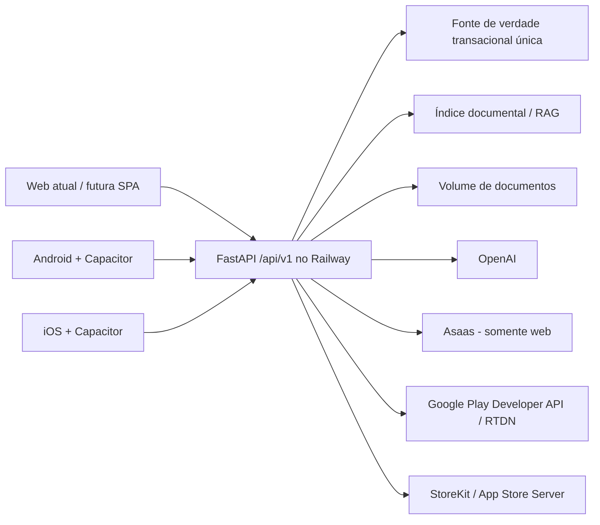

# 2. Arquitetura móvel recomendada

## Decisão

Adotar o **modelo C: interface empacotada no Capacitor, com dados, autenticação, IA, documentos e regras de negócio fornecidos pelo backend único no Railway**.

O modelo A exigiria empacotar uma página Jinja dependente do servidor e não funciona sem extração. O modelo B seria essencialmente um site dentro de WebView, aumentaria riscos de navegação/cookies e teria maior risco de rejeição por valor móvel insuficiente. O modelo C preserva o investimento atual e cria uma fronteira estável para Android e iOS.

Segundo a [configuração oficial do Capacitor](https://capacitorjs.com/docs/config), `webDir` deve apontar para os ativos web compilados e conter o `index.html` final. Essa pasta não existe hoje.

## Arquitetura-alvo



Não haverá banco, OpenAI key, regra de negócio ou cópia do corpus dentro do app. O bundle contém apenas UI, recursos visuais, configuração pública e integração nativa.

## Estrutura proposta no repositório

```text
magister-ia/
  app.py e services/             backend existente
  templates/ e static/          web atual, mantido durante a transição
  mobile/
    src/                         UI compartilhável em TypeScript
    public/
    dist/                        saída gerada; capacitor.config aponta aqui
    capacitor.config.ts
    android/
    ios/
  contracts/                     schemas OpenAPI/JSON compartilhados
```

O diretório `dist/` deve ser gerado, não editado manualmente. A primeira versão pode reutilizar estilos, textos e fluxos do JavaScript atual; a lógica de DOM deve ser organizada em componentes/serviços testáveis.

## API e compatibilidade

- Criar `/api/v1` sem remover as rotas web atuais.
- Definir schemas estáveis para login, sessão, perfil, assinatura, perguntas, streaming, documentos, upload e exclusão.
- Manter compatibilidade de pelo menos uma versão móvel publicada; aplicativos instalados não atualizam de forma síncrona com o backend.
- Usar HTTPS exclusivamente e CORS com origens exatas. Não usar `*` com credenciais.
- Publicar `minimum_supported_app_version` e modo de manutenção via endpoint de configuração.
- Adicionar idempotency keys em criação de checkout, geração cara, upload e exclusão.

## Autenticação móvel

Manter cookies para a web durante a migração. Para Capacitor, usar:

- access token curto, com audience/issuer e escopos;
- refresh token rotativo, opaco e revogável;
- hash do refresh token no servidor;
- armazenamento do refresh token em Keychain (iOS) e Keystore/Encrypted Storage (Android), nunca `localStorage`;
- revogação de todas as sessões após troca de senha, exclusão ou evento de risco;
- renovação serializada para impedir múltiplos refreshes concorrentes.

Empacotar a WebView com o cookie atual é possível como etapa exploratória, mas não é a solução recomendada: o comportamento de cookie, origem e SameSite difere por plataforma e prejudica revogação e observabilidade.

## Persistência

“Banco único” deve significar **uma fonte de verdade compartilhada por web, Android e iOS**, e não um banco embarcado por plataforma. Hoje existem dois arquivos SQLite (transacional/diagnósticos e índice FTS). Para piloto com uma réplica, eles podem permanecer no volume Railway com backups verificados. Antes de escala ou múltiplas réplicas, recomenda-se migrar o banco transacional para PostgreSQL gerenciado; o índice pode ser migrado na mesma fase ou permanecer como artefato reconstruível, desde que não seja fonte de assinatura/usuário.

## Assinaturas e entitlement unificado

O backend resolve o acesso; o cliente nunca “ativa” plano sozinho. Estrutura mínima:

- `subscriptions`: `user_id`, `source`, `platform`, `external_subscription_id`, `original_transaction_id`, `product_id`, `plan`, `status`, início, período atual, renovação, vencimento, cancelamento, reembolso, graça, ambiente e última verificação;
- `subscription_events`: evento externo único, hash/idempotency key, tipo, instante, resultado e payload mínimo protegido;
- `entitlements`: visão materializada do plano efetivo e expiração por usuário.

Fontes: `web_asaas`, `google_play`, `apple_app_store` e, apenas enquanto necessário, `web_mercado_pago_legacy`.

No Android, o app usa Play Billing e o backend valida purchase tokens e recebe RTDN. No iOS, o app usa StoreKit 2 e o backend processa App Store Server Notifications/API. Restauração consulta a loja e reconcilia com a conta autenticada. Cancelamentos, chargebacks, reembolsos, grace period e expiração são eventos server-side idempotentes.

RevenueCat é opcional. Ele reduz código de loja e normaliza eventos, mas adiciona custo e fornecedor. Se adotado, deve ser uma camada de integração; o backend MagisterIA continua sendo a autoridade final e valida webhooks assinados.

## Capacidades nativas justificáveis

- splash e ícones nativos;
- botão voltar Android com política de navegação;
- detecção de rede com o [plugin Network](https://capacitorjs.com/docs/apis/network);
- ciclo de vida e deep links com o [plugin App](https://capacitorjs.com/docs/apis/app);
- links de pagamento/suporte no navegador do sistema com o [plugin Browser](https://capacitorjs.com/docs/apis/browser), somente onde a política permitir;
- seleção de arquivos, download e compartilhamento;
- safe areas, teclado e acessibilidade;
- secure storage por plugin auditado;
- telemetria/crash reporting sem registrar consultas, tokens ou conteúdo privado.

## Regras da WebView

- Não configurar `server.url` para produção como arquitetura principal.
- Manter allowlist de navegação e abrir hosts externos fora da WebView.
- Bloquear HTTP, mixed content, file access desnecessário e bridge legada.
- Não permitir que URLs retornadas por provedor sejam abertas apenas por `startswith("https://")`; validar esquema, hostname e domínio esperado no backend e no cliente.
- Aplicar CSP restritiva aos ativos empacotados e ao web app.

## Sequência de migração

1. estabilizar segurança, conta e contratos;
2. criar API v1 e autenticação móvel sem remover a web;
3. extrair UI empacotável;
4. adicionar Capacitor Android e iOS;
5. implementar lojas e entitlement;
6. concluir UX nativa, testes e publicação gradual.

